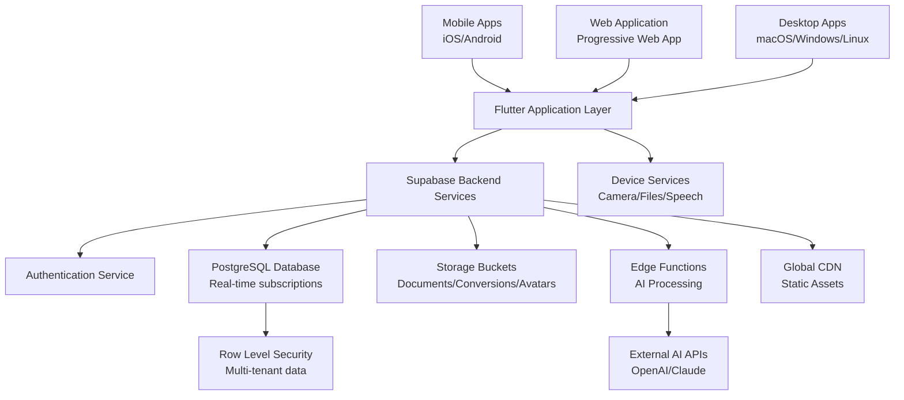
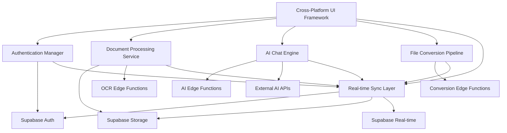
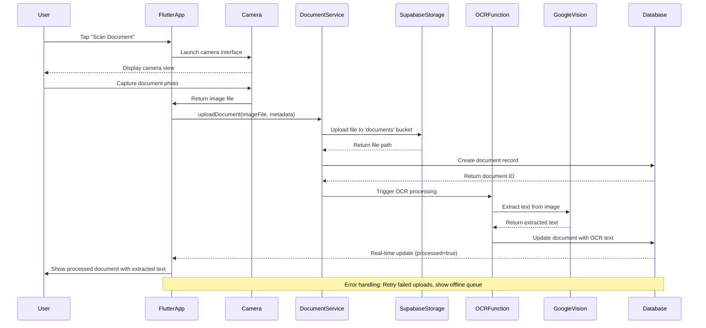
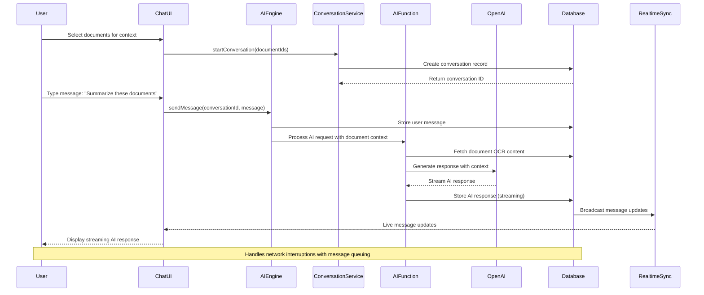
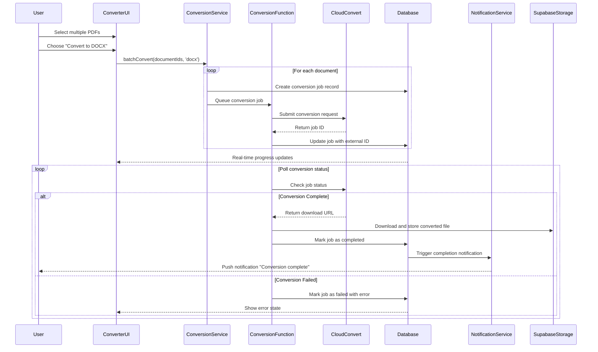
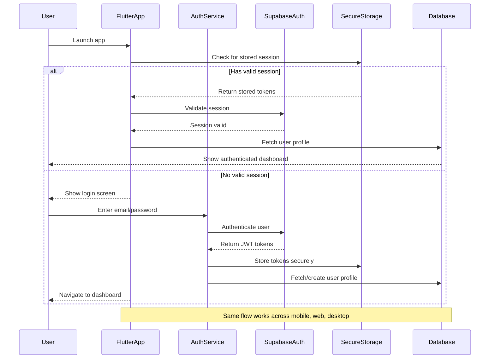
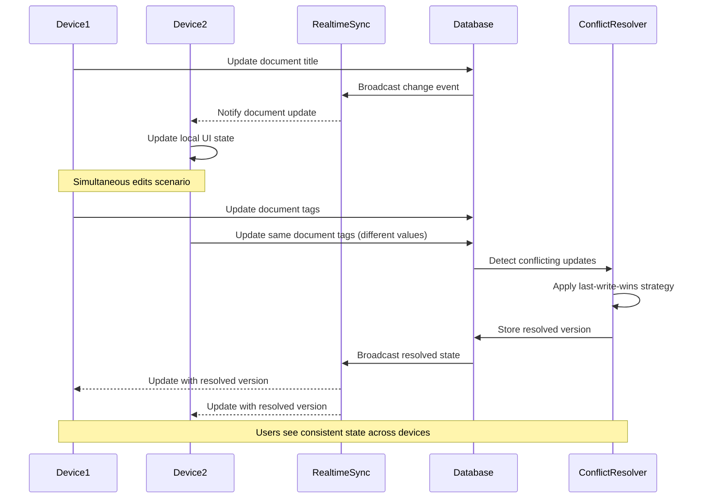
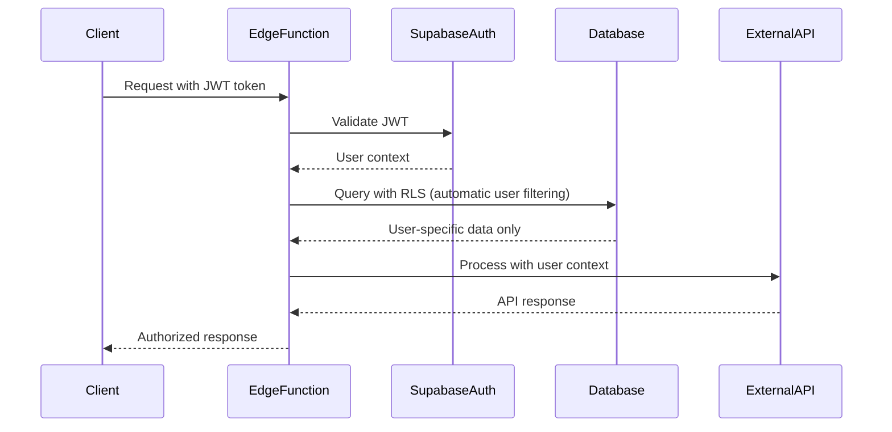
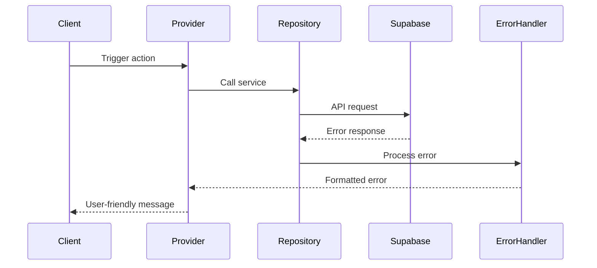

# LuminAI Fullstack Architecture Document

## Introduction

This document outlines the complete fullstack architecture for **LuminAI**, including backend systems, frontend implementation, and their integration. It serves as the single source of truth for AI-driven development, ensuring consistency across the entire technology stack.

This unified approach combines what would traditionally be separate backend and frontend architecture documents, streamlining the development process for modern fullstack applications where these concerns are increasingly intertwined.

### Starter Template or Existing Project

Based on project review, LuminAI is built on:
- **Flutter Framework** with cross-platform support (iOS, Android, Web, Desktop)
- **Supabase Backend-as-a-Service** providing authentication, real-time database, and storage
- **Clean Architecture Pattern** already implemented with feature-based folder structure
- **Riverpod State Management** for reactive state handling
- **GoRouter** for navigation with authentication guards

This is an existing project with solid foundations rather than a greenfield starter template.

### Change Log

| Date | Version | Description | Author |
|------|---------|-------------|---------|
| 2025-08-23 | 1.0 | Initial architecture document | Winston (Architect) |

## High Level Architecture

### Technical Summary

LuminAI employs a mobile-first cross-platform architecture using Flutter as the unified frontend framework with Supabase providing Backend-as-a-Service capabilities. The system integrates real-time document processing, AI-powered analysis, and multi-format file conversion through a clean feature-based architecture. Key integration points include Supabase's real-time database for live chat sessions, storage buckets for document management, and Edge Functions for AI processing workflows. The infrastructure leverages Supabase's global CDN and edge computing for optimal performance, while Flutter's single codebase approach ensures consistent user experience across mobile, web, and desktop platforms.

### Platform and Infrastructure Choice

**Platform:** Supabase + Flutter
**Key Services:** 
- Supabase Authentication (row-level security)
- Supabase Database (PostgreSQL with real-time subscriptions)
- Supabase Storage (file management with CDN)
- Supabase Edge Functions (serverless AI processing)
- Flutter Web/Mobile/Desktop compilation targets
**Deployment Host and Regions:** Supabase global infrastructure (US, EU, Asia-Pacific regions)

### Repository Structure

**Structure:** Single Flutter repository with feature-based modularization
**Monorepo Tool:** Native Flutter package management (no external monorepo tool needed)
**Package Organization:** Feature-driven architecture with shared core services and widgets

### High Level Architecture Diagram



### Architectural Patterns

- **Backend-as-a-Service (BaaS):** Supabase provides managed infrastructure reducing operational complexity - _Rationale:_ Enables rapid development focus on business logic rather than infrastructure management
- **Clean Architecture:** Feature-based separation with domain/data/presentation layers - _Rationale:_ Maintains code organization and testability as the application scales
- **Reactive State Management:** Riverpod for dependency injection and state reactivity - _Rationale:_ Provides type-safe, testable state management with automatic UI updates
- **Real-time Data Synchronization:** Supabase real-time subscriptions for live features - _Rationale:_ Essential for collaborative document editing and live AI chat responses
- **Cross-platform Code Sharing:** Single Flutter codebase for all platforms - _Rationale:_ Reduces development time and ensures UI/UX consistency across platforms

## Tech Stack

| Category | Technology | Version | Purpose | Rationale |
|----------|------------|---------|---------|-----------|
| Frontend Language | Dart | ^3.2.0 | Cross-platform UI development | Type-safe, compiled language with excellent tooling and Flutter integration |
| Frontend Framework | Flutter | ^3.16.0 | Mobile/Web/Desktop UI framework | Single codebase for all platforms, native performance, rich widget ecosystem |
| UI Component Library | Material Design 3 | Built-in | Design system and components | Google's latest design language, built into Flutter, ensures consistency |
| State Management | Riverpod | ^2.6.1 | Reactive state management | Type-safe, testable, compile-time DI with automatic disposal |
| Backend Language | TypeScript/JavaScript | ES2022 | Supabase Edge Functions | Familiar syntax, strong typing, excellent Supabase SDK support |
| Backend Framework | Supabase | ^2.9.1 | Backend-as-a-Service platform | Managed PostgreSQL, real-time, auth, storage, edge functions |
| API Style | REST + Real-time | Supabase Client | Data access and live updates | RESTful operations with WebSocket subscriptions for real-time features |
| Database | PostgreSQL | 15.x | Primary data store | ACID compliance, JSON support, full-text search, row-level security |
| Cache | Supabase Edge Cache | Managed | API response caching | Global CDN caching with automatic invalidation |
| File Storage | Supabase Storage | Managed | Document and image storage | S3-compatible with CDN, image transformations, access policies |
| Authentication | Supabase Auth | Managed | User authentication and authorization | Built-in JWT, social logins, row-level security integration |
| Frontend Testing | Flutter Test | Built-in | Widget and unit testing | Integrated testing framework with widget test capabilities |
| Backend Testing | Deno Test | 1.x | Edge function testing | Native testing for TypeScript serverless functions |
| E2E Testing | Flutter Integration Test | Built-in | End-to-end testing | Cross-platform integration testing with real device support |
| Build Tool | Flutter CLI | ^3.16.0 | Application compilation | Official Flutter build system with platform-specific outputs |
| Bundler | Flutter Web Renderer | CanvasKit | Web application bundling | Optimized web rendering with near-native performance |
| IaC Tool | Supabase CLI | ^1.8.0 | Infrastructure management | Database migrations, function deployment, environment management |
| CI/CD | GitHub Actions | Latest | Automated testing and deployment | Free for public repos, excellent Flutter/Supabase integration |
| Monitoring | Supabase Dashboard | Built-in | Performance and error monitoring | Real-time metrics, query performance, error tracking |
| Logging | Supabase Logs | Built-in | Application and system logging | Centralized logging with real-time streaming and filtering |
| CSS Framework | Flutter Widgets | Built-in | UI styling and theming | Declarative UI with theme-based styling system |

## Data Models

### User
**Purpose:** Represents authenticated users with profile information and preferences

**Key Attributes:**
- id: UUID - Unique identifier linked to Supabase auth
- email: String - User's email address
- name: String - Full display name
- avatarUrl: String? - Optional profile picture URL
- createdAt: DateTime - Account creation timestamp
- preferences: Map<String, dynamic> - User settings (theme, notifications, etc.)

#### TypeScript Interface
```typescript
interface User {
  id: string;
  email: string;
  name: string;
  avatarUrl?: string;
  createdAt: string;
  preferences: Record<string, any>;
}
```

#### Relationships
- One-to-many with Documents
- One-to-many with AI Conversations
- One-to-many with File Conversions

### Document
**Purpose:** Represents scanned, uploaded, or processed documents with metadata and file references

**Key Attributes:**
- id: UUID - Unique document identifier
- userId: UUID - Owner reference
- title: String - User-defined document title
- filePath: String - Storage bucket file path
- fileType: String - MIME type (pdf, jpg, png, etc.)
- fileSize: int - File size in bytes
- ocrText: String? - Extracted text from OCR processing
- tags: List<String> - User-defined tags for organization
- isProcessed: bool - Whether OCR/AI processing is complete
- createdAt: DateTime - Upload timestamp
- updatedAt: DateTime - Last modification time

#### TypeScript Interface
```typescript
interface Document {
  id: string;
  userId: string;
  title: string;
  filePath: string;
  fileType: string;
  fileSize: number;
  ocrText?: string;
  tags: string[];
  isProcessed: boolean;
  createdAt: string;
  updatedAt: string;
}
```

#### Relationships
- Many-to-one with User
- One-to-many with Conversion Jobs
- Referenced by AI Conversations

### AIConversation
**Purpose:** Manages AI chat sessions with document context and conversation history

**Key Attributes:**
- id: UUID - Unique conversation identifier
- userId: UUID - User who owns the conversation
- conversationId: String - Session grouping identifier
- title: String - Auto-generated or user-defined conversation title
- documentIds: List<UUID> - Referenced documents for context
- messages: List<AIMessage> - Conversation history
- createdAt: DateTime - Conversation start time
- updatedAt: DateTime - Last message timestamp
- isActive: bool - Whether conversation is ongoing

#### TypeScript Interface
```typescript
interface AIConversation {
  id: string;
  userId: string;
  conversationId: string;
  title: string;
  documentIds: string[];
  messages: AIMessage[];
  createdAt: string;
  updatedAt: string;
  isActive: boolean;
}

interface AIMessage {
  id: string;
  role: 'user' | 'assistant';
  content: string;
  timestamp: string;
  tokens?: number;
}
```

#### Relationships
- Many-to-one with User
- References multiple Documents
- Contains embedded AIMessage objects

### FileConversion
**Purpose:** Tracks file format conversion jobs and their status

**Key Attributes:**
- id: UUID - Unique conversion job identifier
- userId: UUID - User who initiated conversion
- originalDocumentId: UUID - Source document reference
- originalFilePath: String - Source file location
- convertedFilePath: String? - Output file location (when complete)
- fromFormat: String - Source format (pdf, docx, jpg, etc.)
- toFormat: String - Target format
- status: ConversionStatus - Processing state
- progress: double - Completion percentage (0.0 to 1.0)
- errorMessage: String? - Error details if failed
- createdAt: DateTime - Job creation time
- completedAt: DateTime? - Job completion time

#### TypeScript Interface
```typescript
interface FileConversion {
  id: string;
  userId: string;
  originalDocumentId: string;
  originalFilePath: string;
  convertedFilePath?: string;
  fromFormat: string;
  toFormat: string;
  status: ConversionStatus;
  progress: number;
  errorMessage?: string;
  createdAt: string;
  completedAt?: string;
}

enum ConversionStatus {
  PENDING = 'pending',
  PROCESSING = 'processing',
  COMPLETED = 'completed',
  FAILED = 'failed',
  CANCELLED = 'cancelled'
}
```

#### Relationships
- Many-to-one with User
- References one Document (original)
- May create new Document (converted output)

## API Specification

### REST API Specification

```yaml
openapi: 3.0.0
info:
  title: LuminAI Supabase API
  version: 1.0.0
  description: REST API and real-time subscriptions for LuminAI document processing app
servers:
  - url: https://[project-ref].supabase.co
    description: Supabase hosted backend

paths:
  # Authentication
  /auth/v1/signup:
    post:
      summary: User registration
      requestBody:
        required: true
        content:
          application/json:
            schema:
              type: object
              properties:
                email:
                  type: string
                  format: email
                password:
                  type: string
                  minLength: 6
                data:
                  type: object
                  properties:
                    name:
                      type: string
      responses:
        200:
          description: User created successfully
        400:
          description: Invalid input

  /auth/v1/token:
    post:
      summary: User login
      requestBody:
        required: true
        content:
          application/json:
            schema:
              type: object
              properties:
                email:
                  type: string
                password:
                  type: string
      responses:
        200:
          description: Authentication successful
          content:
            application/json:
              schema:
                type: object
                properties:
                  access_token:
                    type: string
                  user:
                    $ref: '#/components/schemas/User'

  # Documents
  /rest/v1/documents:
    get:
      summary: Get user documents
      parameters:
        - in: query
          name: select
          schema:
            type: string
          example: "*"
        - in: query
          name: order
          schema:
            type: string
          example: "created_at.desc"
      responses:
        200:
          description: List of documents
          content:
            application/json:
              schema:
                type: array
                items:
                  $ref: '#/components/schemas/Document'
    post:
      summary: Create new document
      requestBody:
        required: true
        content:
          application/json:
            schema:
              $ref: '#/components/schemas/DocumentCreate'
      responses:
        201:
          description: Document created

  /rest/v1/documents/{id}:
    get:
      summary: Get document by ID
      parameters:
        - in: path
          name: id
          required: true
          schema:
            type: string
            format: uuid
      responses:
        200:
          description: Document details
          content:
            application/json:
              schema:
                $ref: '#/components/schemas/Document'
    patch:
      summary: Update document
      requestBody:
        content:
          application/json:
            schema:
              $ref: '#/components/schemas/DocumentUpdate'
    delete:
      summary: Delete document
      responses:
        204:
          description: Document deleted

  # AI Conversations
  /rest/v1/ai_conversations:
    get:
      summary: Get user conversations
      responses:
        200:
          description: List of conversations
          content:
            application/json:
              schema:
                type: array
                items:
                  $ref: '#/components/schemas/AIConversation'
    post:
      summary: Create new conversation
      requestBody:
        required: true
        content:
          application/json:
            schema:
              $ref: '#/components/schemas/ConversationCreate'

  # File Conversions
  /rest/v1/file_conversions:
    get:
      summary: Get user conversion jobs
      responses:
        200:
          description: List of conversion jobs
    post:
      summary: Start file conversion
      requestBody:
        required: true
        content:
          application/json:
            schema:
              $ref: '#/components/schemas/ConversionJobCreate'

  # Storage
  /storage/v1/object/documents/{file_path}:
    post:
      summary: Upload document file
      requestBody:
        required: true
        content:
          multipart/form-data:
            schema:
              type: object
              properties:
                file:
                  type: string
                  format: binary
      responses:
        200:
          description: File uploaded successfully
    get:
      summary: Download document file
      responses:
        200:
          description: File content

  # Real-time Subscriptions (WebSocket)
  /realtime/v1/websocket:
    get:
      summary: WebSocket endpoint for real-time subscriptions
      description: |
        Subscribe to real-time changes:
        - ai_conversations:* for live chat updates
        - file_conversions:* for conversion progress
        - documents:* for document changes

components:
  schemas:
    User:
      type: object
      properties:
        id:
          type: string
          format: uuid
        email:
          type: string
        name:
          type: string
        avatar_url:
          type: string
        created_at:
          type: string
          format: date-time

    Document:
      type: object
      properties:
        id:
          type: string
          format: uuid
        user_id:
          type: string
          format: uuid
        title:
          type: string
        file_path:
          type: string
        file_type:
          type: string
        file_size:
          type: integer
        ocr_text:
          type: string
          nullable: true
        tags:
          type: array
          items:
            type: string
        is_processed:
          type: boolean
        created_at:
          type: string
          format: date-time
        updated_at:
          type: string
          format: date-time

    DocumentCreate:
      type: object
      required:
        - title
        - file_path
        - file_type
        - file_size
      properties:
        title:
          type: string
        file_path:
          type: string
        file_type:
          type: string
        file_size:
          type: integer
        tags:
          type: array
          items:
            type: string
          default: []

    AIConversation:
      type: object
      properties:
        id:
          type: string
          format: uuid
        user_id:
          type: string
          format: uuid
        conversation_id:
          type: string
        title:
          type: string
        document_ids:
          type: array
          items:
            type: string
            format: uuid
        messages:
          type: array
          items:
            $ref: '#/components/schemas/AIMessage'
        created_at:
          type: string
          format: date-time
        updated_at:
          type: string
          format: date-time
        is_active:
          type: boolean

    AIMessage:
      type: object
      properties:
        id:
          type: string
        role:
          type: string
          enum: [user, assistant]
        content:
          type: string
        timestamp:
          type: string
          format: date-time
        tokens:
          type: integer

  securitySchemes:
    bearerAuth:
      type: http
      scheme: bearer
      bearerFormat: JWT

security:
  - bearerAuth: []
```

## Components

### Authentication Manager
**Responsibility:** Handles user authentication, session management, and security policies across all platforms

**Key Interfaces:**
- `signIn(email, password)` → User session
- `signUp(email, password, userData)` → User creation
- `signOut()` → Session termination
- `getCurrentUser()` → Current user state
- `onAuthStateChange()` → Real-time auth updates

**Dependencies:** Supabase Auth service, secure storage for tokens

**Technology Stack:** Supabase Flutter client, Riverpod providers for state management, secure local storage for session persistence

### Document Processing Service
**Responsibility:** Manages document upload, OCR processing, metadata extraction, and file organization

**Key Interfaces:**
- `uploadDocument(file, metadata)` → Document entity
- `processOCR(documentId)` → Extracted text
- `updateDocumentMetadata(id, updates)` → Updated document
- `deleteDocument(id)` → Deletion confirmation
- `searchDocuments(query, filters)` → Filtered results

**Dependencies:** Supabase Storage, camera/file picker services, OCR processing functions

**Technology Stack:** Flutter file handling packages, Supabase storage client, Edge Functions for OCR processing, local caching for performance

### AI Chat Engine
**Responsibility:** Manages AI conversations, context integration with documents, and real-time chat functionality

**Key Interfaces:**
- `startConversation(documentContext?)` → Conversation session
- `sendMessage(conversationId, message)` → AI response
- `getConversationHistory(conversationId)` → Message history
- `subscribeToMessages(conversationId)` → Real-time updates
- `summarizeDocument(documentId)` → AI summary

**Dependencies:** External AI APIs (OpenAI/Claude), document content access, real-time messaging infrastructure

**Technology Stack:** Supabase Edge Functions for AI integration, real-time subscriptions, streaming responses for live chat experience

### File Conversion Pipeline
**Responsibility:** Handles format conversions between PDF, DOCX, JPG, TXT with batch processing and progress tracking

**Key Interfaces:**
- `startConversion(documentId, targetFormat)` → Conversion job
- `getConversionStatus(jobId)` → Progress updates
- `cancelConversion(jobId)` → Job cancellation
- `downloadConvertedFile(jobId)` → Converted file access
- `batchConvert(documentIds, targetFormat)` → Batch job

**Dependencies:** File format libraries, cloud processing resources, storage for converted files

**Technology Stack:** Supabase Edge Functions with file conversion libraries, queue management for batch processing, progress tracking via real-time subscriptions

### Cross-Platform UI Framework
**Responsibility:** Provides consistent user interface components and theming across mobile, web, and desktop platforms

**Key Interfaces:**
- `DocumentCard(document, actions)` → Document display component
- `ChatInterface(conversation, onSend)` → AI chat UI
- `FileUploadWidget(onUpload, filters)` → File selection interface
- `ProgressIndicator(progress, status)` → Conversion progress display
- `ThemeManager(lightTheme, darkTheme)` → App theming

**Dependencies:** Flutter widget system, platform-specific adaptations, accessibility services

**Technology Stack:** Flutter Material Design 3, custom widget library, responsive design patterns, platform-adaptive UI elements

### Real-time Synchronization Layer
**Responsibility:** Manages live data updates, offline synchronization, and conflict resolution across devices

**Key Interfaces:**
- `subscribeToChanges(table, filters)` → Live data stream
- `syncOfflineChanges()` → Upload local changes
- `resolveConflicts(conflicts)` → Conflict resolution
- `enableOfflineMode(enabled)` → Offline capability toggle
- `getConnectionStatus()` → Network state monitoring

**Dependencies:** Supabase real-time subscriptions, local database for offline storage, network connectivity monitoring

**Technology Stack:** Supabase real-time client, SQLite for local storage, Riverpod for state synchronization, background sync services

### Component Architecture Diagram


## External APIs

### OpenAI API
- **Purpose:** Primary AI engine for document analysis, summarization, and conversational assistance
- **Documentation:** https://platform.openai.com/docs/api-reference
- **Base URL(s):** https://api.openai.com/v1
- **Authentication:** Bearer token authentication with API key
- **Rate Limits:** Tier-based limits (10,000 TPM for starter, up to 2M TPM for scale)

**Key Endpoints Used:**
- `POST /chat/completions` - AI chat responses and document analysis
- `POST /completions` - Text completion for document enhancement
- `POST /embeddings` - Document similarity and search functionality

**Integration Notes:** Implemented through Supabase Edge Functions to secure API keys and enable server-side processing. Supports streaming responses for real-time chat experience. Token usage tracking for cost management.

### Google Cloud Vision API
- **Purpose:** OCR text extraction from scanned documents and images
- **Documentation:** https://cloud.google.com/vision/docs/reference/rest
- **Base URL(s):** https://vision.googleapis.com/v1
- **Authentication:** Service account key or OAuth 2.0
- **Rate Limits:** 1,800 requests per minute per project

**Key Endpoints Used:**
- `POST /images:annotate` - Text detection and extraction from images
- `POST /files:asyncBatchAnnotate` - Batch processing for multiple documents

**Integration Notes:** Handles various image formats (JPG, PNG, PDF pages). Text extraction results stored in document metadata. Supports multiple languages and handwriting recognition.

### Anthropic Claude API  
- **Purpose:** Alternative AI provider for enhanced reasoning and document analysis
- **Documentation:** https://docs.anthropic.com/claude/reference
- **Base URL(s):** https://api.anthropic.com/v1
- **Authentication:** API key via x-api-key header
- **Rate Limits:** Model-dependent (Claude-3: 50 requests/minute)

**Key Endpoints Used:**
- `POST /messages` - Conversational AI with document context
- `POST /complete` - Text analysis and enhancement

**Integration Notes:** Fallback option when OpenAI is unavailable. Excellent for complex document analysis and legal/technical content processing. Longer context windows for large documents.

### File Conversion Services (CloudConvert API)
- **Purpose:** Handles file format conversions between PDF, DOCX, JPG, TXT, and other formats
- **Documentation:** https://cloudconvert.com/api/v2
- **Base URL(s):** https://api.cloudconvert.com/v2
- **Authentication:** API key authentication
- **Rate Limits:** Plan-dependent (1,000 conversions/month for free tier)

**Key Endpoints Used:**
- `POST /jobs` - Create conversion job with source and target formats
- `GET /jobs/{id}` - Monitor conversion progress and status
- `GET /files/{id}/download` - Download converted file

**Integration Notes:** Asynchronous processing with webhook notifications. Supports batch conversions and custom conversion parameters. Quality settings configurable per conversion type.

### Speech-to-Text Service (Google Cloud Speech API)
- **Purpose:** Voice input processing for document search and AI chat interactions
- **Documentation:** https://cloud.google.com/speech-to-text/docs/reference/rest
- **Base URL(s):** https://speech.googleapis.com/v1
- **Authentication:** Service account credentials
- **Rate Limits:** 1,000 requests per 100 seconds per user

**Key Endpoints Used:**
- `POST /speech:recognize` - Convert audio to text for short recordings
- `POST /speech:longrunningrecognize` - Process longer audio files

**Integration Notes:** Real-time speech recognition for voice commands. Multiple language support. Noise cancellation and speaker identification capabilities.

## Core Workflows

### Document Scanning and Processing Workflow


### AI Chat with Document Context Workflow


### File Conversion Batch Processing Workflow


### Cross-Platform Authentication Flow


### Real-time Data Synchronization Workflow


## Database Schema

```sql
-- Enable necessary extensions
CREATE EXTENSION IF NOT EXISTS "uuid-ossp";
CREATE EXTENSION IF NOT EXISTS "pg_trgm";
CREATE EXTENSION IF NOT EXISTS "pgcrypto";

-- Users table (extends Supabase auth.users)
CREATE TABLE public.users (
  id UUID REFERENCES auth.users ON DELETE CASCADE PRIMARY KEY,
  email TEXT NOT NULL UNIQUE,
  name TEXT NOT NULL,
  avatar_url TEXT,
  preferences JSONB DEFAULT '{}',
  created_at TIMESTAMP WITH TIME ZONE DEFAULT timezone('utc'::text, now()) NOT NULL,
  updated_at TIMESTAMP WITH TIME ZONE DEFAULT timezone('utc'::text, now()) NOT NULL
);

-- Documents table
CREATE TABLE public.documents (
  id UUID DEFAULT uuid_generate_v4() PRIMARY KEY,
  user_id UUID REFERENCES public.users(id) ON DELETE CASCADE NOT NULL,
  title TEXT NOT NULL,
  file_path TEXT NOT NULL,
  file_type TEXT NOT NULL,
  file_size BIGINT NOT NULL,
  ocr_text TEXT,
  tags TEXT[] DEFAULT '{}',
  is_processed BOOLEAN DEFAULT false,
  thumbnail_path TEXT,
  created_at TIMESTAMP WITH TIME ZONE DEFAULT timezone('utc'::text, now()) NOT NULL,
  updated_at TIMESTAMP WITH TIME ZONE DEFAULT timezone('utc'::text, now()) NOT NULL
);

-- AI Conversations table
CREATE TABLE public.ai_conversations (
  id UUID DEFAULT uuid_generate_v4() PRIMARY KEY,
  user_id UUID REFERENCES public.users(id) ON DELETE CASCADE NOT NULL,
  conversation_id TEXT NOT NULL,
  title TEXT NOT NULL,
  document_ids UUID[] DEFAULT '{}',
  messages JSONB DEFAULT '[]',
  is_active BOOLEAN DEFAULT true,
  created_at TIMESTAMP WITH TIME ZONE DEFAULT timezone('utc'::text, now()) NOT NULL,
  updated_at TIMESTAMP WITH TIME ZONE DEFAULT timezone('utc'::text, now()) NOT NULL
);

-- File Conversions table
CREATE TABLE public.file_conversions (
  id UUID DEFAULT uuid_generate_v4() PRIMARY KEY,
  user_id UUID REFERENCES public.users(id) ON DELETE CASCADE NOT NULL,
  original_document_id UUID REFERENCES public.documents(id) ON DELETE CASCADE NOT NULL,
  original_file_path TEXT NOT NULL,
  converted_file_path TEXT,
  from_format TEXT NOT NULL,
  to_format TEXT NOT NULL,
  status TEXT NOT NULL DEFAULT 'pending' CHECK (status IN ('pending', 'processing', 'completed', 'failed', 'cancelled')),
  progress DECIMAL(3,2) DEFAULT 0.0 CHECK (progress >= 0.0 AND progress <= 1.0),
  error_message TEXT,
  external_job_id TEXT,
  created_at TIMESTAMP WITH TIME ZONE DEFAULT timezone('utc'::text, now()) NOT NULL,
  completed_at TIMESTAMP WITH TIME ZONE
);

-- Document Shares table (for future collaboration features)
CREATE TABLE public.document_shares (
  id UUID DEFAULT uuid_generate_v4() PRIMARY KEY,
  document_id UUID REFERENCES public.documents(id) ON DELETE CASCADE NOT NULL,
  shared_by UUID REFERENCES public.users(id) ON DELETE CASCADE NOT NULL,
  shared_with UUID REFERENCES public.users(id) ON DELETE CASCADE NOT NULL,
  permission TEXT NOT NULL DEFAULT 'read' CHECK (permission IN ('read', 'write', 'admin')),
  expires_at TIMESTAMP WITH TIME ZONE,
  created_at TIMESTAMP WITH TIME ZONE DEFAULT timezone('utc'::text, now()) NOT NULL
);

-- Indexes for performance optimization
CREATE INDEX idx_documents_user_id ON public.documents(user_id);
CREATE INDEX idx_documents_created_at ON public.documents(created_at DESC);
CREATE INDEX idx_documents_file_type ON public.documents(file_type);
CREATE INDEX idx_documents_tags ON public.documents USING GIN(tags);
CREATE INDEX idx_documents_ocr_text ON public.documents USING GIN(to_tsvector('english', ocr_text));

CREATE INDEX idx_conversations_user_id ON public.ai_conversations(user_id);
CREATE INDEX idx_conversations_created_at ON public.ai_conversations(created_at DESC);
CREATE INDEX idx_conversations_active ON public.ai_conversations(is_active) WHERE is_active = true;

CREATE INDEX idx_conversions_user_id ON public.file_conversions(user_id);
CREATE INDEX idx_conversions_status ON public.file_conversions(status);
CREATE INDEX idx_conversions_document_id ON public.file_conversions(original_document_id);

CREATE INDEX idx_shares_document_id ON public.document_shares(document_id);
CREATE INDEX idx_shares_shared_with ON public.document_shares(shared_with);

-- Full-text search indexes
CREATE INDEX idx_documents_full_text ON public.documents 
  USING GIN(to_tsvector('english', title || ' ' || COALESCE(ocr_text, '')));

-- Row Level Security (RLS) Policies
ALTER TABLE public.users ENABLE ROW LEVEL SECURITY;
ALTER TABLE public.documents ENABLE ROW LEVEL SECURITY;
ALTER TABLE public.ai_conversations ENABLE ROW LEVEL SECURITY;
ALTER TABLE public.file_conversions ENABLE ROW LEVEL SECURITY;
ALTER TABLE public.document_shares ENABLE ROW LEVEL SECURITY;

-- Users can only see and modify their own profile
CREATE POLICY "Users can view own profile" ON public.users
  FOR SELECT USING (auth.uid() = id);
CREATE POLICY "Users can update own profile" ON public.users
  FOR UPDATE USING (auth.uid() = id);

-- Documents - users can only access their own documents
CREATE POLICY "Users can view own documents" ON public.documents
  FOR SELECT USING (auth.uid() = user_id);
CREATE POLICY "Users can insert own documents" ON public.documents
  FOR INSERT WITH CHECK (auth.uid() = user_id);
CREATE POLICY "Users can update own documents" ON public.documents
  FOR UPDATE USING (auth.uid() = user_id);
CREATE POLICY "Users can delete own documents" ON public.documents
  FOR DELETE USING (auth.uid() = user_id);

-- AI Conversations - users can only access their own conversations
CREATE POLICY "Users can view own conversations" ON public.ai_conversations
  FOR SELECT USING (auth.uid() = user_id);
CREATE POLICY "Users can insert own conversations" ON public.ai_conversations
  FOR INSERT WITH CHECK (auth.uid() = user_id);
CREATE POLICY "Users can update own conversations" ON public.ai_conversations
  FOR UPDATE USING (auth.uid() = user_id);
CREATE POLICY "Users can delete own conversations" ON public.ai_conversations
  FOR DELETE USING (auth.uid() = user_id);

-- File Conversions - users can only access their own conversion jobs
CREATE POLICY "Users can view own conversions" ON public.file_conversions
  FOR SELECT USING (auth.uid() = user_id);
CREATE POLICY "Users can insert own conversions" ON public.file_conversions
  FOR INSERT WITH CHECK (auth.uid() = user_id);
CREATE POLICY "Users can update own conversions" ON public.file_conversions
  FOR UPDATE USING (auth.uid() = user_id);

-- Document Shares - users can view shares they created or received
CREATE POLICY "Users can view relevant shares" ON public.document_shares
  FOR SELECT USING (auth.uid() = shared_by OR auth.uid() = shared_with);
CREATE POLICY "Users can create shares for own documents" ON public.document_shares
  FOR INSERT WITH CHECK (
    auth.uid() = shared_by AND 
    EXISTS (SELECT 1 FROM public.documents WHERE id = document_id AND user_id = auth.uid())
  );

-- Functions for automated tasks
CREATE OR REPLACE FUNCTION public.update_updated_at_column()
RETURNS TRIGGER AS $$
BEGIN
  NEW.updated_at = timezone('utc'::text, now());
  RETURN NEW;
END;
$$ language 'plpgsql';

-- Triggers for automatic timestamp updates
CREATE TRIGGER update_users_updated_at 
  BEFORE UPDATE ON public.users 
  FOR EACH ROW EXECUTE PROCEDURE public.update_updated_at_column();

CREATE TRIGGER update_documents_updated_at 
  BEFORE UPDATE ON public.documents 
  FOR EACH ROW EXECUTE PROCEDURE public.update_updated_at_column();

CREATE TRIGGER update_conversations_updated_at 
  BEFORE UPDATE ON public.ai_conversations 
  FOR EACH ROW EXECUTE PROCEDURE public.update_updated_at_column();

-- Realtime subscriptions setup
ALTER PUBLICATION supabase_realtime ADD TABLE public.documents;
ALTER PUBLICATION supabase_realtime ADD TABLE public.ai_conversations;
ALTER PUBLICATION supabase_realtime ADD TABLE public.file_conversions;
```

## Frontend Architecture

### Component Architecture

#### Component Organization
```text
lib/
├── features/
│   ├── auth/
│   │   ├── presentation/
│   │   │   ├── pages/
│   │   │   │   ├── login_page.dart
│   │   │   │   ├── signup_page.dart
│   │   │   │   └── password_reset_page.dart
│   │   │   └── widgets/
│   │   │       ├── auth_form.dart
│   │   │       └── social_login_buttons.dart
│   │   ├── providers/
│   │   │   └── auth_provider.dart
│   │   └── data/
│   │       └── auth_repository.dart
│   ├── home/
│   │   ├── presentation/
│   │   │   ├── pages/
│   │   │   │   └── dashboard_page.dart
│   │   │   └── widgets/
│   │   │       ├── feature_card.dart
│   │   │       ├── search_bar.dart
│   │   │       └── user_greeting.dart
│   │   └── providers/
│   │       └── dashboard_provider.dart
│   ├── scanner/
│   │   ├── presentation/
│   │   │   ├── pages/
│   │   │   │   ├── camera_page.dart
│   │   │   │   └── document_preview_page.dart
│   │   │   └── widgets/
│   │   │       ├── camera_controls.dart
│   │   │       └── crop_overlay.dart
│   │   ├── providers/
│   │   │   └── scanner_provider.dart
│   │   └── data/
│   │       └── ocr_service.dart
│   ├── ai_chat/
│   │   ├── presentation/
│   │   │   ├── pages/
│   │   │   │   └── chat_page.dart
│   │   │   └── widgets/
│   │   │       ├── message_bubble.dart
│   │   │       ├── typing_indicator.dart
│   │   │       └── document_context_panel.dart
│   │   └── providers/
│   │       └── chat_provider.dart
│   ├── editor/
│   │   └── presentation/
│   │       ├── pages/
│   │       │   └── pdf_editor_page.dart
│   │       └── widgets/
│   │           ├── annotation_tools.dart
│   │           └── signature_pad.dart
│   └── converter/
│       ├── presentation/
│       │   ├── pages/
│       │   │   └── conversion_queue_page.dart
│       │   └── widgets/
│       │       ├── format_selector.dart
│       │       └── progress_card.dart
│       └── providers/
│           └── conversion_provider.dart
└── shared/
    ├── widgets/
    │   ├── loading_indicator.dart
    │   ├── error_card.dart
    │   └── custom_app_bar.dart
    └── providers/
        ├── theme_provider.dart
        └── connectivity_provider.dart
```

#### Component Template
```dart
// Flutter Widget Component Template
class FeatureCard extends ConsumerWidget {
  const FeatureCard({
    Key? key,
    required this.title,
    required this.icon,
    required this.onTap,
    this.subtitle,
    this.color,
  }) : super(key: key);

  final String title;
  final IconData icon;
  final VoidCallback onTap;
  final String? subtitle;
  final Color? color;

  @override
  Widget build(BuildContext context, WidgetRef ref) {
    final theme = Theme.of(context);
    
    return Card(
      elevation: 2,
      child: InkWell(
        onTap: onTap,
        borderRadius: BorderRadius.circular(12),
        child: Padding(
          padding: const EdgeInsets.all(16),
          child: Column(
            mainAxisAlignment: MainAxisAlignment.center,
            children: [
              Icon(
                icon,
                size: 48,
                color: color ?? theme.primaryColor,
              ),
              const SizedBox(height: 12),
              Text(
                title,
                style: theme.textTheme.titleMedium,
                textAlign: TextAlign.center,
              ),
              if (subtitle != null) ...[
                const SizedBox(height: 4),
                Text(
                  subtitle!,
                  style: theme.textTheme.bodySmall,
                  textAlign: TextAlign.center,
                ),
              ],
            ],
          ),
        ),
      ),
    );
  }
}
```

### State Management Architecture

#### State Structure
```dart
// Riverpod Provider Structure
@riverpod
class AuthNotifier extends _$AuthNotifier {
  @override
  AsyncValue<User?> build() {
    return const AsyncValue.loading();
  }

  Future<void> signIn(String email, String password) async {
    state = const AsyncValue.loading();
    try {
      final user = await ref.read(authRepositoryProvider).signIn(email, password);
      state = AsyncValue.data(user);
    } catch (error, stackTrace) {
      state = AsyncValue.error(error, stackTrace);
    }
  }

  Future<void> signOut() async {
    await ref.read(authRepositoryProvider).signOut();
    state = const AsyncValue.data(null);
  }
}

@riverpod
class DocumentsNotifier extends _$DocumentsNotifier {
  @override
  AsyncValue<List<Document>> build() {
    return const AsyncValue.loading();
  }

  Future<void> loadDocuments() async {
    state = const AsyncValue.loading();
    try {
      final documents = await ref.read(documentRepositoryProvider).getDocuments();
      state = AsyncValue.data(documents);
    } catch (error, stackTrace) {
      state = AsyncValue.error(error, stackTrace);
    }
  }

  Future<void> uploadDocument(File file, String title) async {
    try {
      await ref.read(documentRepositoryProvider).uploadDocument(file, title);
      await loadDocuments(); // Refresh list
    } catch (error) {
      // Handle error appropriately
    }
  }
}
```

#### State Management Patterns
- **Reactive Updates:** Providers automatically rebuild widgets when state changes
- **Dependency Injection:** Repository patterns injected through Riverpod providers
- **Error Handling:** AsyncValue provides loading, data, and error states
- **State Persistence:** Critical state persisted through secure storage
- **Memory Management:** Automatic disposal of providers when not needed

### Routing Architecture

#### Route Organization
```text
/
├── /auth
│   ├── /login
│   ├── /signup
│   └── /reset-password
├── /dashboard (protected)
├── /scanner (protected)
│   ├── /camera
│   └── /preview
├── /documents (protected)
│   └── /:documentId
├── /chat (protected)
│   └── /:conversationId
├── /converter (protected)
└── /settings (protected)
```

#### Protected Route Pattern
```dart
final routerProvider = Provider<GoRouter>((ref) {
  final authState = ref.watch(authNotifierProvider);
  
  return GoRouter(
    redirect: (context, state) {
      final isLoggedIn = authState.value != null;
      final isAuthRoute = state.location.startsWith('/auth');
      
      // Redirect to login if not authenticated and trying to access protected route
      if (!isLoggedIn && !isAuthRoute) {
        return '/auth/login';
      }
      
      // Redirect to dashboard if authenticated and on auth route
      if (isLoggedIn && isAuthRoute) {
        return '/dashboard';
      }
      
      return null;
    },
    routes: [
      GoRoute(
        path: '/dashboard',
        builder: (context, state) => const DashboardPage(),
      ),
      GoRoute(
        path: '/scanner',
        builder: (context, state) => const ScannerPage(),
        routes: [
          GoRoute(
            path: '/camera',
            builder: (context, state) => const CameraPage(),
          ),
        ],
      ),
      // Additional routes...
    ],
  );
});
```

### Frontend Services Layer

#### API Client Setup
```dart
@riverpod
SupabaseClient supabaseClient(SupabaseClientRef ref) {
  return Supabase.instance.client;
}

@riverpod
class DocumentRepository extends _$DocumentRepository {
  @override
  DocumentRepository build() {
    return DocumentRepository._(ref.read(supabaseClientProvider));
  }

  final SupabaseClient _client;
  
  DocumentRepository._(this._client);

  Future<List<Document>> getDocuments() async {
    final response = await _client
        .from('documents')
        .select()
        .order('created_at', ascending: false);
    
    return response.map((json) => Document.fromJson(json)).toList();
  }

  Future<Document> uploadDocument(File file, String title) async {
    // Upload file to storage
    final fileName = '${DateTime.now().millisecondsSinceEpoch}_${file.path.split('/').last}';
    final filePath = await _client.storage
        .from('documents')
        .upload(fileName, file);

    // Create document record
    final response = await _client
        .from('documents')
        .insert({
          'title': title,
          'file_path': filePath,
          'file_type': file.path.split('.').last,
          'file_size': await file.length(),
        })
        .select()
        .single();

    return Document.fromJson(response);
  }
}
```

#### Service Example
```dart
@riverpod
class ChatService extends _$ChatService {
  @override
  ChatService build() {
    return ChatService._(ref.read(supabaseClientProvider));
  }

  final SupabaseClient _client;
  ChatService._(this._client);

  Stream<List<AIMessage>> subscribeToMessages(String conversationId) {
    return _client
        .from('ai_conversations')
        .stream(primaryKey: ['id'])
        .eq('conversation_id', conversationId)
        .map((data) => data.map((json) => 
            AIConversation.fromJson(json).messages).toList());
  }

  Future<void> sendMessage(String conversationId, String content) async {
    // Add user message to conversation
    await _client.rpc('add_message_to_conversation', params: {
      'conversation_id': conversationId,
      'role': 'user',
      'content': content,
    });

    // Trigger AI response via Edge Function
    await _client.functions.invoke('process-ai-message', body: {
      'conversationId': conversationId,
      'message': content,
    });
  }
}
```

## Backend Architecture

### Service Architecture - Supabase Edge Functions

#### Function Organization
```text
supabase/
├── functions/
│   ├── process-ocr/
│   │   ├── index.ts
│   │   └── types.ts
│   ├── ai-chat-handler/
│   │   ├── index.ts
│   │   ├── openai-client.ts
│   │   └── conversation-manager.ts
│   ├── file-converter/
│   │   ├── index.ts
│   │   ├── cloudconvert-client.ts
│   │   └── conversion-queue.ts
│   ├── document-analyzer/
│   │   ├── index.ts
│   │   └── analysis-engine.ts
│   └── notification-service/
│       ├── index.ts
│       └── push-notifications.ts
└── config.toml
```

#### Function Template
```typescript
import { serve } from "https://deno.land/std@0.168.0/http/server.ts";
import { createClient } from 'https://esm.sh/@supabase/supabase-js@2';

interface ProcessOCRRequest {
  documentId: string;
  filePath: string;
  fileType: string;
}

serve(async (req: Request) => {
  try {
    // CORS handling
    if (req.method === 'OPTIONS') {
      return new Response('ok', { 
        headers: {
          'Access-Control-Allow-Origin': '*',
          'Access-Control-Allow-Headers': 'authorization, x-client-info, apikey, content-type',
        }
      });
    }

    // Initialize Supabase client
    const supabaseClient = createClient(
      Deno.env.get('SUPABASE_URL') ?? '',
      Deno.env.get('SUPABASE_ANON_KEY') ?? '',
      {
        global: {
          headers: { Authorization: req.headers.get('Authorization')! },
        },
      }
    );

    // Parse request
    const { documentId, filePath, fileType }: ProcessOCRRequest = await req.json();

    // Download file from storage
    const { data: fileData, error: downloadError } = await supabaseClient.storage
      .from('documents')
      .download(filePath);

    if (downloadError) {
      throw new Error(`Failed to download file: ${downloadError.message}`);
    }

    // Process OCR using Google Vision API
    const ocrResult = await processWithGoogleVision(fileData, fileType);

    // Update document with extracted text
    const { error: updateError } = await supabaseClient
      .from('documents')
      .update({
        ocr_text: ocrResult.text,
        is_processed: true,
        updated_at: new Date().toISOString(),
      })
      .eq('id', documentId);

    if (updateError) {
      throw new Error(`Failed to update document: ${updateError.message}`);
    }

    return new Response(
      JSON.stringify({ 
        success: true, 
        extractedText: ocrResult.text,
        confidence: ocrResult.confidence 
      }),
      {
        headers: { 
          'Content-Type': 'application/json',
          'Access-Control-Allow-Origin': '*',
        },
      }
    );

  } catch (error) {
    console.error('OCR processing error:', error);
    
    return new Response(
      JSON.stringify({ 
        error: error.message,
        success: false 
      }),
      {
        status: 500,
        headers: { 
          'Content-Type': 'application/json',
          'Access-Control-Allow-Origin': '*',
        },
      }
    );
  }
});

async function processWithGoogleVision(fileData: Blob, fileType: string) {
  const visionApiKey = Deno.env.get('GOOGLE_VISION_API_KEY');
  const base64Data = btoa(String.fromCharCode(...new Uint8Array(await fileData.arrayBuffer())));

  const response = await fetch('https://vision.googleapis.com/v1/images:annotate?key=' + visionApiKey, {
    method: 'POST',
    headers: {
      'Content-Type': 'application/json',
    },
    body: JSON.stringify({
      requests: [{
        image: {
          content: base64Data
        },
        features: [{
          type: 'TEXT_DETECTION',
          maxResults: 1
        }]
      }]
    })
  });

  const result = await response.json();
  const annotations = result.responses[0]?.textAnnotations;
  
  if (!annotations || annotations.length === 0) {
    return { text: '', confidence: 0 };
  }

  return {
    text: annotations[0].description,
    confidence: annotations[0].confidence || 0.95
  };
}
```

### Database Architecture

#### Schema Design
```sql
-- Core tables already defined in Database Schema section
-- Additional views and functions for backend operations

-- View for document analytics
CREATE VIEW document_analytics AS
SELECT 
  user_id,
  COUNT(*) as total_documents,
  SUM(file_size) as total_storage_used,
  COUNT(CASE WHEN is_processed = true THEN 1 END) as processed_documents,
  AVG(file_size) as avg_file_size,
  array_agg(DISTINCT file_type) as file_types_used
FROM documents 
GROUP BY user_id;

-- Function to get user's recent activity
CREATE OR REPLACE FUNCTION get_user_activity(user_uuid UUID, days_back INTEGER DEFAULT 7)
RETURNS TABLE (
  date DATE,
  documents_uploaded INTEGER,
  conversations_started INTEGER,
  conversions_completed INTEGER
) AS $$
BEGIN
  RETURN QUERY
  WITH date_range AS (
    SELECT generate_series(
      (CURRENT_DATE - INTERVAL '%s days')::date,
      CURRENT_DATE,
      '1 day'::interval
    )::date as date
  ),
  doc_stats AS (
    SELECT 
      created_at::date as date,
      COUNT(*) as documents_uploaded
    FROM documents 
    WHERE user_id = user_uuid 
      AND created_at >= (CURRENT_DATE - INTERVAL '%s days')
    GROUP BY created_at::date
  ),
  conv_stats AS (
    SELECT 
      created_at::date as date,
      COUNT(*) as conversations_started
    FROM ai_conversations 
    WHERE user_id = user_uuid 
      AND created_at >= (CURRENT_DATE - INTERVAL '%s days')
    GROUP BY created_at::date
  ),
  conversion_stats AS (
    SELECT 
      completed_at::date as date,
      COUNT(*) as conversions_completed
    FROM file_conversions 
    WHERE user_id = user_uuid 
      AND status = 'completed'
      AND completed_at >= (CURRENT_DATE - INTERVAL '%s days')
    GROUP BY completed_at::date
  )
  SELECT 
    dr.date,
    COALESCE(ds.documents_uploaded, 0) as documents_uploaded,
    COALESCE(cs.conversations_started, 0) as conversations_started,
    COALESCE(cons.conversions_completed, 0) as conversions_completed
  FROM date_range dr
  LEFT JOIN doc_stats ds ON dr.date = ds.date
  LEFT JOIN conv_stats cs ON dr.date = cs.date  
  LEFT JOIN conversion_stats cons ON dr.date = cons.date
  ORDER BY dr.date;
END;
$$ LANGUAGE plpgsql;
```

#### Data Access Layer
```typescript
// Repository Pattern Implementation for Edge Functions
export class DocumentRepository {
  constructor(private supabase: SupabaseClient) {}

  async getDocumentById(id: string, userId: string): Promise<Document | null> {
    const { data, error } = await this.supabase
      .from('documents')
      .select('*')
      .eq('id', id)
      .eq('user_id', userId)
      .single();

    if (error) {
      throw new Error(`Failed to fetch document: ${error.message}`);
    }

    return data;
  }

  async searchDocuments(userId: string, query: string): Promise<Document[]> {
    const { data, error } = await this.supabase
      .from('documents')
      .select('*')
      .eq('user_id', userId)
      .textSearch('fts', query)
      .order('created_at', { ascending: false });

    if (error) {
      throw new Error(`Search failed: ${error.message}`);
    }

    return data;
  }

  async updateDocumentOCR(id: string, ocrText: string): Promise<void> {
    const { error } = await this.supabase
      .from('documents')
      .update({
        ocr_text: ocrText,
        is_processed: true,
        updated_at: new Date().toISOString(),
      })
      .eq('id', id);

    if (error) {
      throw new Error(`Failed to update document: ${error.message}`);
    }
  }
}

export class ConversationRepository {
  constructor(private supabase: SupabaseClient) {}

  async addMessage(conversationId: string, role: 'user' | 'assistant', content: string): Promise<void> {
    // Use PostgreSQL JSON functions to append message
    const { error } = await this.supabase.rpc('add_message_to_conversation', {
      conversation_id: conversationId,
      message_role: role,
      message_content: content,
      message_timestamp: new Date().toISOString(),
    });

    if (error) {
      throw new Error(`Failed to add message: ${error.message}`);
    }
  }

  async getConversationContext(conversationId: string): Promise<{
    conversation: AIConversation;
    documents: Document[];
  }> {
    const { data: conversation, error: convError } = await this.supabase
      .from('ai_conversations')
      .select('*')
      .eq('conversation_id', conversationId)
      .single();

    if (convError) {
      throw new Error(`Failed to fetch conversation: ${convError.message}`);
    }

    let documents: Document[] = [];
    if (conversation.document_ids?.length > 0) {
      const { data: docs, error: docsError } = await this.supabase
        .from('documents')
        .select('*')
        .in('id', conversation.document_ids);

      if (docsError) {
        throw new Error(`Failed to fetch documents: ${docsError.message}`);
      }
      
      documents = docs;
    }

    return { conversation, documents };
  }
}
```

### Authentication and Authorization

#### Auth Flow


#### Middleware/Guards
```typescript
// Authentication middleware for Edge Functions
export function withAuth(handler: (req: Request, user: User) => Promise<Response>) {
  return async (req: Request): Promise<Response> => {
    try {
      const authHeader = req.headers.get('Authorization');
      if (!authHeader || !authHeader.startsWith('Bearer ')) {
        return new Response('Unauthorized', { status: 401 });
      }

      const token = authHeader.replace('Bearer ', '');
      const supabase = createClient(
        Deno.env.get('SUPABASE_URL')!,
        Deno.env.get('SUPABASE_ANON_KEY')!,
        {
          global: {
            headers: { Authorization: authHeader },
          },
        }
      );

      const { data: { user }, error } = await supabase.auth.getUser(token);
      
      if (error || !user) {
        return new Response('Invalid token', { status: 401 });
      }

      return await handler(req, user);
    } catch (error) {
      console.error('Auth middleware error:', error);
      return new Response('Authentication failed', { status: 500 });
    }
  };
}

// Usage in Edge Function
serve(withAuth(async (req: Request, user: User) => {
  // Function logic here - user is guaranteed to be authenticated
  // Row Level Security automatically filters database queries by user.id
  
  const supabase = createClient(
    Deno.env.get('SUPABASE_URL')!,
    Deno.env.get('SUPABASE_SERVICE_ROLE_KEY')!, // Service role for admin operations
  );

  // All database operations automatically respect RLS policies
  return new Response('Authenticated response');
}));
```

## Unified Project Structure

```plaintext
LuminAI/
├── .github/                           # CI/CD workflows
│   └── workflows/
│       ├── flutter-ci.yaml          # Flutter build and test
│       ├── supabase-deploy.yaml     # Edge function deployment
│       └── release.yaml             # App store deployment
├── android/                          # Android platform configuration
│   ├── app/
│   │   ├── build.gradle.kts         # Android build configuration
│   │   └── src/main/AndroidManifest.xml
│   └── build.gradle.kts
├── ios/                              # iOS platform configuration  
│   ├── Runner.xcodeproj/
│   ├── Runner/
│   │   ├── Info.plist               # iOS app configuration
│   │   └── AppDelegate.swift
│   └── Podfile                      # iOS dependencies
├── web/                              # Web platform configuration
│   ├── index.html                   # Web app entry point
│   └── manifest.json               # PWA configuration
├── macos/                            # macOS desktop configuration
│   └── Runner.xcodeproj/
├── windows/                          # Windows desktop configuration
│   └── runner/
├── linux/                            # Linux desktop configuration
│   └── runner/
├── lib/                              # Flutter application code
│   ├── main.dart                    # Application entry point
│   ├── app/
│   │   ├── app.dart                 # Main app widget with providers
│   │   ├── router.dart              # GoRouter configuration
│   │   └── theme.dart               # Material Design 3 theme
│   ├── features/                    # Feature-based modules
│   │   ├── auth/                    # Authentication feature
│   │   │   ├── data/
│   │   │   │   └── auth_repository.dart
│   │   │   ├── domain/
│   │   │   │   └── auth_models.dart
│   │   │   ├── presentation/
│   │   │   │   ├── pages/
│   │   │   │   │   ├── login_page.dart
│   │   │   │   │   ├── signup_page.dart
│   │   │   │   │   └── password_reset_page.dart
│   │   │   │   └── widgets/
│   │   │   │       ├── auth_form.dart
│   │   │   │       └── social_login_buttons.dart
│   │   │   └── providers/
│   │   │       └── auth_provider.dart
│   │   ├── home/                    # Dashboard and main navigation
│   │   │   ├── presentation/
│   │   │   │   ├── pages/
│   │   │   │   │   └── dashboard_page.dart
│   │   │   │   └── widgets/
│   │   │   │       ├── feature_card.dart
│   │   │   │       ├── search_bar.dart
│   │   │   │       ├── user_greeting.dart
│   │   │   │       └── notification_badge.dart
│   │   │   └── providers/
│   │   │       └── dashboard_provider.dart
│   │   ├── scanner/                 # Document scanning feature
│   │   │   ├── data/
│   │   │   │   ├── scanner_repository.dart
│   │   │   │   └── ocr_service.dart
│   │   │   ├── domain/
│   │   │   │   └── scanner_models.dart
│   │   │   ├── presentation/
│   │   │   │   ├── pages/
│   │   │   │   │   ├── camera_page.dart
│   │   │   │   │   ├── document_preview_page.dart
│   │   │   │   │   └── ocr_results_page.dart
│   │   │   │   └── widgets/
│   │   │   │       ├── camera_controls.dart
│   │   │   │       ├── crop_overlay.dart
│   │   │   │       └── scan_progress_indicator.dart
│   │   │   └── providers/
│   │   │       └── scanner_provider.dart
│   │   ├── editor/                  # Document editing feature
│   │   │   ├── data/
│   │   │   │   └── editor_repository.dart
│   │   │   ├── presentation/
│   │   │   │   ├── pages/
│   │   │   │   │   ├── pdf_editor_page.dart
│   │   │   │   │   └── image_editor_page.dart
│   │   │   │   └── widgets/
│   │   │   │       ├── annotation_tools.dart
│   │   │   │       ├── signature_pad.dart
│   │   │   │       └── text_overlay_tool.dart
│   │   │   └── providers/
│   │   │       └── editor_provider.dart
│   │   ├── converter/               # File conversion feature
│   │   │   ├── data/
│   │   │   │   ├── converter_repository.dart
│   │   │   │   └── conversion_service.dart
│   │   │   ├── domain/
│   │   │   │   └── conversion_models.dart
│   │   │   ├── presentation/
│   │   │   │   ├── pages/
│   │   │   │   │   ├── conversion_queue_page.dart
│   │   │   │   │   └── batch_converter_page.dart
│   │   │   │   └── widgets/
│   │   │   │       ├── format_selector.dart
│   │   │   │       ├── progress_card.dart
│   │   │   │       └── conversion_history.dart
│   │   │   └── providers/
│   │   │       └── conversion_provider.dart
│   │   └── ai_chat/                 # AI assistance feature
│   │       ├── data/
│   │       │   ├── chat_repository.dart
│   │       │   └── ai_service.dart
│   │       ├── domain/
│   │       │   └── chat_models.dart
│   │       ├── presentation/
│   │       │   ├── pages/
│   │       │   │   ├── chat_page.dart
│   │       │   │   └── conversation_list_page.dart
│   │       │   └── widgets/
│   │       │       ├── message_bubble.dart
│   │       │       ├── typing_indicator.dart
│   │       │       ├── document_context_panel.dart
│   │       │       └── chat_input.dart
│   │       └── providers/
│   │           └── chat_provider.dart
│   ├── shared/                      # Shared components and utilities
│   │   ├── constants/
│   │   │   ├── app_constants.dart   # App-wide constants
│   │   │   ├── api_constants.dart   # API endpoints and keys
│   │   │   └── theme_constants.dart # Design system tokens
│   │   ├── providers/
│   │   │   ├── supabase_provider.dart # Supabase client provider
│   │   │   ├── app_state_provider.dart # Global app state
│   │   │   ├── theme_provider.dart  # Theme and dark mode
│   │   │   └── connectivity_provider.dart # Network status
│   │   ├── utils/
│   │   │   ├── date_utils.dart      # Date formatting utilities
│   │   │   ├── file_utils.dart      # File handling helpers
│   │   │   ├── validation_utils.dart # Form validation
│   │   │   └── error_handler.dart   # Global error handling
│   │   └── widgets/
│   │       ├── loading_indicator.dart # Loading states
│   │       ├── error_card.dart      # Error display
│   │       ├── custom_app_bar.dart  # Reusable app bar
│   │       ├── responsive_layout.dart # Responsive design
│   │       └── platform_adaptive_widget.dart # Platform-specific UI
│   └── core/                        # Core business logic and services
│       ├── models/
│       │   ├── user_model.dart      # User data model
│       │   ├── document_model.dart  # Document data model
│       │   ├── conversation_model.dart # AI conversation model
│       │   └── conversion_model.dart # File conversion model
│       ├── services/
│       │   ├── auth_service.dart    # Authentication service
│       │   ├── storage_service.dart # File storage service
│       │   ├── notification_service.dart # Push notifications
│       │   ├── analytics_service.dart # Usage analytics
│       │   └── sync_service.dart    # Offline sync service
│       └── exceptions/
│           ├── app_exceptions.dart  # Custom exception types
│           └── error_codes.dart     # Error code constants
├── supabase/                        # Supabase backend configuration
│   ├── config.toml                  # Supabase project config
│   ├── functions/                   # Edge Functions
│   │   ├── process-ocr/
│   │   │   ├── index.ts             # OCR processing function
│   │   │   └── types.ts             # TypeScript interfaces
│   │   ├── ai-chat-handler/
│   │   │   ├── index.ts             # AI chat processing
│   │   │   ├── openai-client.ts     # OpenAI integration
│   │   │   └── conversation-manager.ts
│   │   ├── file-converter/
│   │   │   ├── index.ts             # File conversion handler
│   │   │   ├── cloudconvert-client.ts
│   │   │   └── conversion-queue.ts
│   │   └── notification-service/
│   │       ├── index.ts             # Push notification handler
│   │       └── push-client.ts
│   ├── migrations/                  # Database migrations
│   │   ├── 20240101000000_initial_schema.sql
│   │   ├── 20240102000000_add_indexes.sql
│   │   └── 20240103000000_add_rls_policies.sql
│   └── seed.sql                     # Initial data for development
├── test/                            # Test files
│   ├── widget_test.dart            # Widget tests
│   ├── unit/                       # Unit tests
│   │   ├── models/
│   │   ├── services/
│   │   └── utils/
│   ├── integration/                # Integration tests
│   │   ├── auth_flow_test.dart
│   │   ├── document_upload_test.dart
│   │   └── ai_chat_test.dart
│   └── test_helpers/               # Test utilities
│       ├── mock_supabase.dart
│       └── test_fixtures.dart
├── assets/                         # Static assets
│   ├── images/
│   │   ├── logos/
│   │   ├── icons/
│   │   └── illustrations/
│   ├── fonts/                      # Custom fonts
│   └── sounds/                     # Audio files
├── scripts/                        # Build and deployment scripts
│   ├── build_all_platforms.sh     # Multi-platform build
│   ├── deploy_supabase.sh         # Deploy backend functions
│   └── generate_app_icons.sh      # Icon generation
├── docs/                           # Documentation
│   ├── prd.md                     # Product requirements
│   ├── architecture.md           # This architecture document
│   ├── api_documentation.md      # API reference
│   └── deployment_guide.md       # Deployment instructions
├── .env.example                   # Environment variables template
├── pubspec.yaml                   # Flutter dependencies and configuration
├── analysis_options.yaml         # Dart linting rules
├── README.md                      # Project overview and setup
├── CHANGELOG.md                   # Version history
└── LICENSE                        # Software license
```

## Development Workflow

### Local Development Setup

#### Prerequisites
```bash
# Install Flutter SDK (3.16.0 or higher)
git clone https://github.com/flutter/flutter.git -b stable
export PATH="$PATH:`pwd`/flutter/bin"

# Install Dart SDK (included with Flutter)
flutter --version

# Install Supabase CLI
npm install -g @supabase/cli@1.8.0

# Install platform-specific tools
# For iOS development (macOS only)
xcode-select --install
sudo xcodebuild -license accept

# For Android development
# Download Android Studio and set ANDROID_HOME
export ANDROID_HOME=$HOME/Library/Android/sdk
export PATH=$PATH:$ANDROID_HOME/emulator:$ANDROID_HOME/tools:$ANDROID_HOME/platform-tools

# Verify installation
flutter doctor
```

#### Initial Setup
```bash
# Clone repository
git clone https://github.com/your-org/LuminAI.git
cd LuminAI

# Install Flutter dependencies
flutter pub get

# Set up environment variables
cp .env.example .env
# Edit .env with your Supabase credentials

# Initialize Supabase
supabase init
supabase start

# Run database migrations
supabase db reset

# Deploy Edge Functions (development)
supabase functions deploy --no-verify-jwt

# Generate platform configurations
flutter create . --platforms=web,macos,windows,linux

# Verify setup
flutter test
flutter analyze
```

#### Development Commands
```bash
# Start all services
flutter run -d chrome --web-port 3000 &
supabase start

# Start Flutter app on specific platforms
flutter run -d chrome                    # Web browser
flutter run -d "iPhone 15"              # iOS simulator  
flutter run -d emulator-5554            # Android emulator
flutter run -d macos                    # macOS desktop
flutter run -d windows                  # Windows desktop
flutter run -d linux                    # Linux desktop

# Start with hot reload and debugging
flutter run --hot --debug

# Backend development
supabase functions serve --no-verify-jwt # Local Edge Functions
supabase db start                        # Local database

# Run tests
flutter test                            # Unit and widget tests
flutter test integration_test/          # Integration tests
flutter drive --target=test_driver/app.dart # E2E tests

# Code generation and analysis
flutter packages pub run build_runner build --delete-conflicting-outputs
flutter analyze                         # Static analysis
flutter format .                        # Code formatting

# Database operations
supabase db reset                       # Reset local database
supabase gen types dart --local > lib/core/supabase_types.dart # Generate types
supabase migration new migration_name   # Create new migration
```

### Environment Configuration

#### Required Environment Variables

```bash
# Frontend (.env.local)
SUPABASE_URL=http://localhost:54321
SUPABASE_ANON_KEY=your_anon_key_here
SUPABASE_SERVICE_ROLE_KEY=your_service_role_key_here

# External API Keys (for Edge Functions)
OPENAI_API_KEY=sk-your_openai_key_here
ANTHROPIC_API_KEY=your_claude_key_here
GOOGLE_VISION_API_KEY=your_google_vision_key_here
CLOUDCONVERT_API_KEY=your_cloudconvert_key_here

# Production Environment
SUPABASE_URL=https://your-project.supabase.co
SUPABASE_ANON_KEY=your_production_anon_key
```

## Deployment Architecture

### Deployment Strategy

**Frontend Deployment:**
- **Platform:** Multi-platform deployment (App Stores + Web)
- **Build Command:** `flutter build [platform] --release`
- **Output Directory:** `build/[platform]/`
- **CDN/Edge:** Supabase Storage CDN for web assets, platform stores for native apps

**Backend Deployment:**
- **Platform:** Supabase Edge Functions (globally distributed)
- **Build Command:** `supabase functions deploy`
- **Deployment Method:** Serverless auto-scaling functions

### CI/CD Pipeline
```yaml
name: LuminAI Deployment Pipeline
on:
  push:
    branches: [main, develop]
  pull_request:
    branches: [main]

jobs:
  test:
    runs-on: ubuntu-latest
    steps:
      - uses: actions/checkout@v3
      - uses: subosito/flutter-action@v2
      - run: flutter test
      - run: flutter analyze

  build-and-deploy:
    needs: test
    runs-on: ubuntu-latest
    steps:
      - name: Deploy Backend
        run: supabase functions deploy --project-ref ${{ secrets.SUPABASE_PROJECT_REF }}
      
      - name: Build Flutter Web
        run: flutter build web --release
        
      - name: Deploy to Supabase Storage
        run: supabase storage cp build/web/* storage://web-app/
```

### Environments
| Environment | Frontend URL | Backend URL | Purpose |
|-------------|-------------|-------------|---------|
| Development | localhost:3000 | localhost:54321 | Local development |
| Staging | staging.luminai.app | staging-api.luminai.app | Pre-production testing |
| Production | app.luminai.app | api.luminai.app | Live environment |

## Security and Performance

### Security Requirements

**Frontend Security:**
- CSP Headers: `default-src 'self'; connect-src https://*.supabase.co`
- XSS Prevention: Content sanitization and secure rendering
- Secure Storage: Encrypted local storage for sensitive data

**Backend Security:**
- Input Validation: Schema-based validation for all API inputs
- Rate Limiting: 100 requests/minute per user for API calls
- CORS Policy: Restricted to app domains only

**Authentication Security:**
- Token Storage: Secure encrypted storage with auto-refresh
- Session Management: JWT with sliding expiration (24 hours)
- Password Policy: Minimum 8 characters, complexity requirements

### Performance Optimization

**Frontend Performance:**
- Bundle Size Target: <2MB initial load for web
- Loading Strategy: Lazy loading with skeleton screens
- Caching Strategy: Aggressive caching of static assets and API responses

**Backend Performance:**
- Response Time Target: <500ms for API calls, <2s for AI responses
- Database Optimization: Optimized indexes and query patterns
- Caching Strategy: Redis-compatible caching through Supabase

## Testing Strategy

### Testing Pyramid
```text
        E2E Tests (5%)
       /              \
    Integration Tests (15%)
   /                      \
Frontend Unit (40%)  Backend Unit (40%)
```

### Test Organization

#### Frontend Tests
```text
test/
├── unit/
│   ├── models/
│   ├── providers/
│   └── services/
├── widget/
│   ├── auth/
│   ├── scanner/
│   └── chat/
└── integration/
    ├── user_flows/
    └── api_integration/
```

#### Backend Tests
```text
supabase/functions/
├── _shared/
│   └── test-utils.ts
├── process-ocr/
│   └── process-ocr.test.ts
└── ai-chat-handler/
    └── ai-chat.test.ts
```

#### E2E Tests
```text
integration_test/
├── app_test.dart
├── auth_flow_test.dart
└── document_workflow_test.dart
```

### Test Examples

#### Frontend Component Test
```dart
testWidgets('FeatureCard displays title and handles tap', (WidgetTester tester) async {
  bool tapped = false;
  
  await tester.pumpWidget(
    MaterialApp(
      home: FeatureCard(
        title: 'Test Feature',
        icon: Icons.star,
        onTap: () => tapped = true,
      ),
    ),
  );

  expect(find.text('Test Feature'), findsOneWidget);
  expect(find.byIcon(Icons.star), findsOneWidget);

  await tester.tap(find.byType(FeatureCard));
  expect(tapped, true);
});
```

#### Backend API Test
```typescript
Deno.test("OCR processing function handles valid input", async () => {
  const mockRequest = new Request("http://localhost:8000", {
    method: "POST",
    body: JSON.stringify({
      documentId: "test-doc-123",
      filePath: "documents/test-image.jpg",
      fileType: "image/jpeg"
    }),
    headers: {
      "Content-Type": "application/json",
      "Authorization": "Bearer test-token"
    }
  });

  const response = await ocrHandler(mockRequest);
  const result = await response.json();

  assertEquals(response.status, 200);
  assertEquals(result.success, true);
  assertExists(result.extractedText);
});
```

#### E2E Test
```dart
testWidgets('Complete document scan workflow', (WidgetTester tester) async {
  await tester.pumpWidget(MyApp());
  
  // Login
  await tester.enterText(find.byKey(Key('email_field')), 'test@example.com');
  await tester.enterText(find.byKey(Key('password_field')), 'password123');
  await tester.tap(find.byKey(Key('login_button')));
  await tester.pumpAndSettle();
  
  // Navigate to scanner
  await tester.tap(find.byKey(Key('scan_feature_card')));
  await tester.pumpAndSettle();
  
  // Simulate document scan
  await tester.tap(find.byKey(Key('camera_capture_button')));
  await tester.pumpAndSettle(Duration(seconds: 3));
  
  // Verify document appears in list
  expect(find.text('Scanned Document'), findsOneWidget);
});
```

## Coding Standards

### Critical Fullstack Rules
- **Type Sharing:** Always use shared TypeScript interfaces between frontend and backend
- **API Calls:** Use Supabase client methods only, never direct HTTP calls
- **Environment Variables:** Access through config objects, never hardcoded values
- **Error Handling:** All async operations must include proper error handling
- **State Updates:** Use Riverpod providers for all state management
- **File Organization:** Follow feature-based folder structure consistently

### Naming Conventions
| Element | Frontend | Backend | Example |
|---------|----------|---------|---------|
| Widgets | PascalCase | - | `DocumentCard` |
| Providers | camelCase + Provider | - | `authProvider` |
| Functions | camelCase | camelCase | `processDocument` |
| Database Tables | - | snake_case | `ai_conversations` |

## Error Handling Strategy

### Error Flow


### Error Response Format
```typescript
interface ApiError {
  error: {
    code: string;
    message: string;
    details?: Record<string, any>;
    timestamp: string;
    requestId: string;
  };
}
```

### Frontend Error Handling
```dart
class GlobalErrorHandler {
  static void handleError(Object error, StackTrace stackTrace) {
    if (error is SupabaseException) {
      _showUserFriendlyError(error.message);
    } else if (error is NetworkException) {
      _showNetworkError();
    } else {
      _showGenericError();
    }
    
    // Log error for monitoring
    FirebaseCrashlytics.instance.recordError(error, stackTrace);
  }
}
```

### Backend Error Handling
```typescript
export function handleError(error: unknown): Response {
  console.error('Function error:', error);
  
  if (error instanceof ValidationError) {
    return new Response(JSON.stringify({
      error: {
        code: 'VALIDATION_ERROR',
        message: error.message,
        details: error.details,
        timestamp: new Date().toISOString(),
        requestId: crypto.randomUUID(),
      }
    }), { status: 400 });
  }
  
  return new Response(JSON.stringify({
    error: {
      code: 'INTERNAL_ERROR',
      message: 'An unexpected error occurred',
      timestamp: new Date().toISOString(),
      requestId: crypto.randomUUID(),
    }
  }), { status: 500 });
}
```

## Monitoring and Observability

### Monitoring Stack
- **Frontend Monitoring:** Flutter Performance monitoring with custom metrics
- **Backend Monitoring:** Supabase Dashboard with real-time metrics
- **Error Tracking:** Sentry integration for crash reporting
- **Performance Monitoring:** Real User Monitoring (RUM) for web app

### Key Metrics
**Frontend Metrics:**
- App launch time
- Screen transition speed
- Memory usage
- JavaScript errors

**Backend Metrics:**
- Function execution time
- Database query performance
- Error rates
- API response times

**Business Metrics:**
- Document processing success rate
- User engagement
- Conversion rates
- Feature usage analytics

---

This comprehensive architecture document provides the complete blueprint for building and scaling LuminAI. The design balances modern development practices with practical implementation requirements, ensuring both developer productivity and user experience excellence.